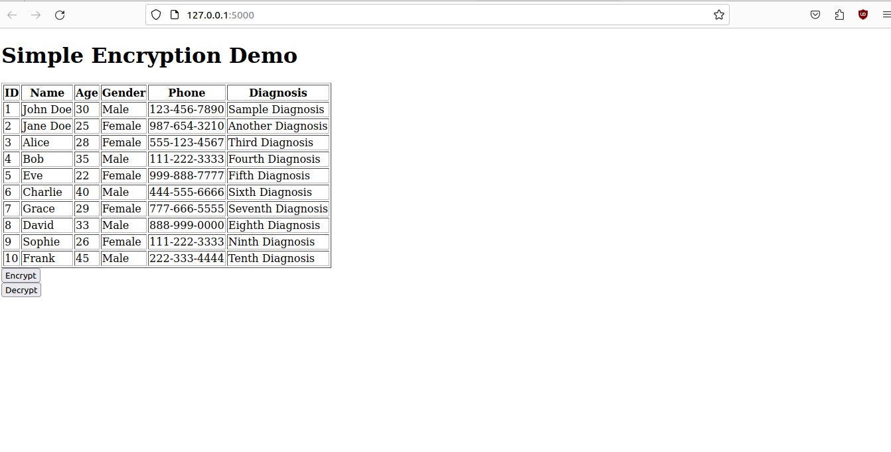

-- Vishal Kumar

## Task 1

Category 1 : Database and Backend Development
Task 2        :  Patient Data Encryption Module
● Objective: Code a module for encrypting and decrypting patient data in the
database.
● Requirements:
   Implement encryption algorithms for sensitive data fields.
   Test encryption and decryption functionalities on a sample/mock
   database containing patient diagnosis, name, age, gender, and phone.
### Insight Guide

In the encryption program, the algorithm used for encryption is the Advanced Encryption Standard (AES). AES is a symmetric encryption algorithm widely used for securing sensitive data. It is known for its security and efficiency.
Here's a snippet of the relevant part of the code that utilizes AES for encryption :

In this code:

- `encryption_key` is the secret key used for both encryption and decryption.
- `iv` (Initialization Vector) is a fixed-size input used as an additional input to the encryption algorithm.

The `encrypt` function takes plaintext as input, pads it to the block size, encrypts it using AES in CBC (Cipher Block Chaining) mode, and returns the base64-encoded ciphertext.

The `decrypt` function takes the base64-encoded ciphertext, decodes it, decrypts it using AES in CBC mode, and returns the original plaintext after removing any padding.

###  Operational Procedure

I have implemented the Patient Data Encryption module in two different ways :
1. In `main.py` : As a python module to encrypt a sample data set :
    
2. Proof of concept Implementation in a website : 
	Let's assume that a user inputs his details on the hospital website.  We want to ensure that data is encrypted before it is stored in the database. I have created a simple website to demonstrate this. 

    I have used `Flask` as the web framework for easy integration with external libraries, including cryptographic library `pycryptodome` :

	Running the Flask App :
    

	Website demo :
    

	The "Encrypt" button encrypts the data :
	

	The "Decrypt" button decrypts it and displays the original content to the user :
	

### Running the program 

In the directory where the source files are located, open the terminal and run following commands :
	`pip install Flask`
	`pip install Flask mysql-connector-python`
	`pip install pycryptodome`

1. In `main.py` : 
	In the terminal, run : `python main.py`
	Observe the output. The data is encrypted and then decrypted.
2. For website implementaion :
	In the terminal, run :
	`python app.py`
	Visit `http://127.0.0.1:5000/` in your web browser or open the link being displayed in the terminal window.

### Overview
I have implemented the `Patient Data Encryption Module` in two different ways to demonstrate the usage and applications.
For further testing, a MySQL database can be used to test the encryption.

## Task 2
Category 3 : Practical Coding
Task 2         : Appointment Scheduling Algorithm
● Objective: Write an algorithm for efficient appointment scheduling.
● Requirements:
   Develop a scheduling system considering factors like appointment
   duration and doctor availability.
   Test the algorithm with a simulated calendar and mock appointments.

### Insight Guide 

Depending on factors such as appointment duration and doctor availability, I have created a `Python` program that checks availability and informs the user about the scheduling possible.

### Operation Procedure 
As the task considers only 2 factors, the algorithm is fairly simple.

It checks if a doctor is available at the appointment time. If yes, then the doctor is scheduled, otherwise, the patient is informed about the unavailability of doctors.

### Running the Program :

In the terminal window, redirect to the directory where `appointment_scheduling.py` is located.
In the terminal, run the command : `python appointment_scheduling.py`
Observe the scheduled timetable, displaying the doctors scheduled for each patient, as well the overall time table of the doctor.

### Overview :
As the task did not specify the specific needs of the user, I have adopted a simple program.
However, the code can be modified to check a database or website entries and schedule appointments, if needed.

1. Efficiency Considerations : 
    If `n` is the number of doctors and `m` is the total number of appointments across all doctors, the overall time complexity of the code is O(n + m).
    The efficiency of the code can be improved in certain scenarios, especially when dealing with a large number of appointments. For example, using data structures like a priority queue or a more sophisticated scheduling algorithm could further optimize the scheduling process.

I have used a simple algorithm as the task did not specify the specific needs. The code can be further modified as needed.
